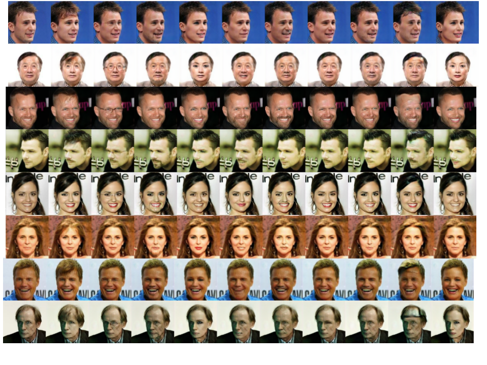

# StarGAN

Tensorflow implementation of [StarGAN: Unified Generative Adversarial Networks for Multi-Domain Image-to-Image Translation](https://arxiv.org/abs/1711.09020) <br>

## Prerequisites
* Python 3.6
* Tensorflow 1.6

## Results for Facial Attribute Transfer on CelebA
The images are generated by StarGAN trained on the CelebA dataset.

<p align="center"></p>

## Usage

#### 1. Clone the repository
```bash
$ git clone https://github.com/ioanachelu/StarGAN.git
$ cd StarGAN/
```

#### 2. Download the dataset into ```./data```. It should have the following substructure:
        .data
            celebA
            list_attr_celebs.txt

#### 3. Train StarGAN with CelebA
```bash
$ python train.py --train=True --logdir=./logdir --config=default --dataset_path=../data
```

#### 4. Resume StarGAN training with CelebA
```bash
$ python train.py --train=True --resume=True --load_from=./logdir/0-default --config=default --dataset_path=../data
```

#### 4. Test StarGAN
```bash
$ python run_wild.py --logdir=./logdir --config=default --load_from=./logdir/0-default --dataset_type=test
```
